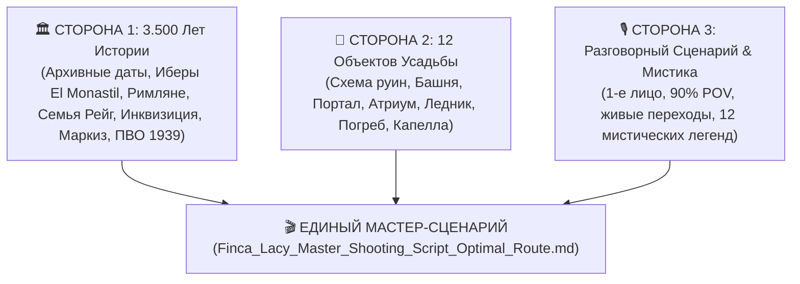
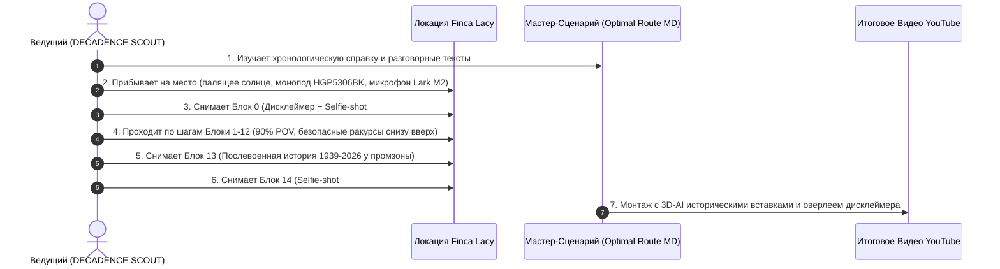
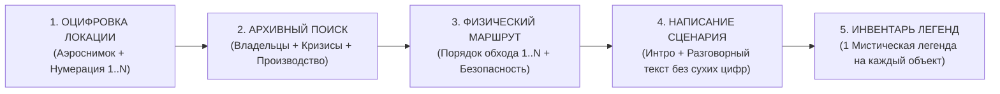
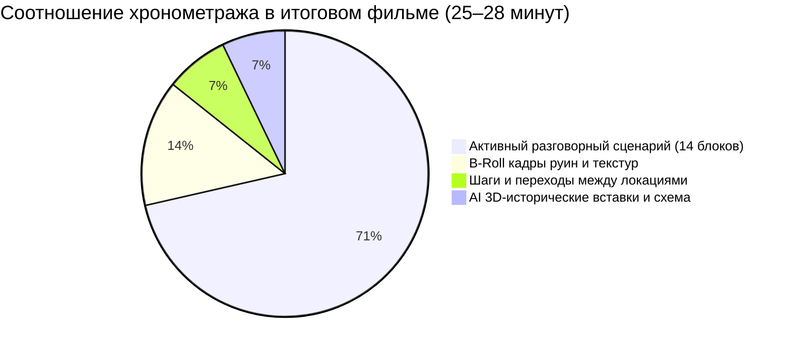
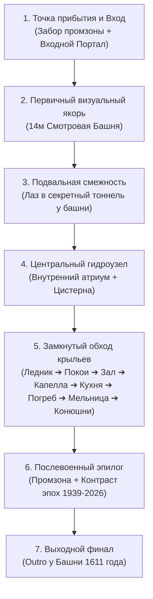
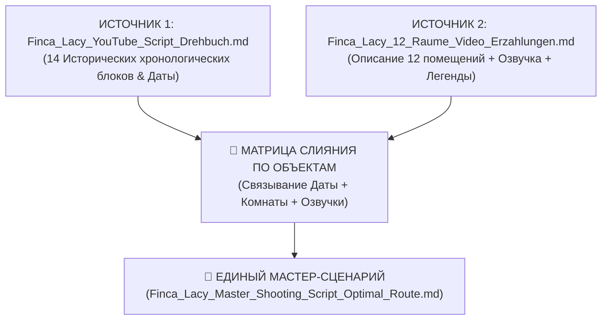
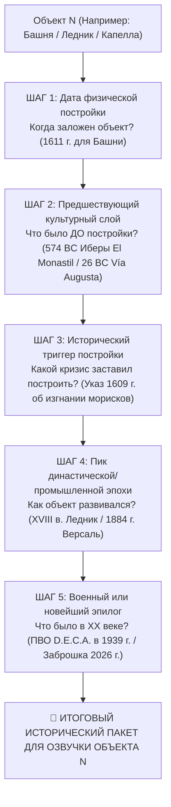

# 🧭 МЕТОДОЛОГИЯ И КОНЦЕПЦИЯ «3-СТОРОННЕГО СИНТЕЗА» (FINCA LACY / DECADENCE SCOUT)
## (Полное руководство по объединению 3.500 лет истории, 12 архитектурных объектов и разговорного сценария для съёмки видео)

---

## 📐 I. СУТЬ И КОНЦЕПЦИЯ МЕТОДА «3-СТОРОННЕГО СИНТЕЗА»

Создание профессионального историко-документального видеоролика для YouTube-канала **DECADENCE SCOUT** на руинах усадьбы **Finca Lacy** основано на едином методе **«3-стороннего синтеза»**. 

Этот метод решает главную проблему Urbex-видео: *как не превратить ролик в сухую лекцию с числами и при этом не скатиться в поверхностную прогулку без глубоких фактов.*

---

## 🏛️ II. СТОРОНА 1: ХРОНОЛОГИЧЕСКИЙ И АРХИВНЫЙ ПЛАСТ (3.500 ЛЕТ ИСТОРИИ)

Каждый объект усадьбы Finca Lacy опирается на строгий исторический фундамент, извлеченный из архивов провинции Аликанте, реестров Инквизиции и государственного бюллетеня BOE:

1. **874–574 гг. до н.э. (Финикийцы & Бронзовый век)**: Торговля с местными племенами шафраном и рудой.
2. **574–374 гг. до н.э. (Иберы Contestani & Акрополь El Monastil)**: Поселение иберов племени *Contestani* из укрепленного городища *El Monastil* (в 1.5 км отсюда) у водных ключей *Al-Jaud*. Торговля оливковым маслом и шафраном с Картахеной (*Qart Hadasht*).
3. **218–201 гг. до н.э. (Вторая Пуническая война & Ганнибал)**: Проход 90-тысячной армии и 37 боевых слонов Ганнибала по иберийской тропе.
4. **26 г. до н.э. (Римская империя)**: Завоевание Августа. Постройка каменной дороги *Vía Augusta* и постоялой станции *Mansio et Taberna Ad Ello*.
5. **713 г. н.э. (Пакт Тудмира & Аль-Андалус)**: Договор Теодемира и Абд аль-Азиза. Строительство подземных акведуков *qanats* от источника *Al-Jaud*.
6. **1391 / 1482 гг. (Сефардские roots & Инквизиция)**: Погромы в Валенсии. Насильственное крещение предков семьи Рейг (*conversos*). Судебные процессы Инквизиции над Франсеском и Жауме Рейгом за тайный Йом-Киппур.
7. **22 сентября 1609 г. (Указ Филиппа III)**: Изгнание 5000 морисков. Ночные набеги партизан-монфис (*monfíes*) из гор Сьерра-де-Салинас.
8. **22 сентября 1611 г. (Основание имения Рейг)**: Паскуаль Рейг I закладывает арочный портал "1611", 14-метровую башню со стенами 1.8м, капеллу Святого Паскуаля и 1.5-км тайный тоннель.
9. **1611–1856 гг. (240 лет Семьи Рейг)**: 8 поколений патриархов с именем Паскуаль Рейг (I–IV). Строительство ледника (1730-е), расширение маслодавильни (1826) и винодельни Monastrell (1820).
10. **1856 год (Династический брак)**: Свадьба единственной наследницы Мануэлы Рейг с Сальвадором де Ласи (потомком ирландцев из Лимерика, бежавших в 1691 г. во время *Flight of the Wild Geese*).
11. **1883–1884 гг. (Титул I Маркиза де Ласи)**: Декреты Папы Льва XIII и короля Альфонсо XII. Версальская перестройка дворца с фресками, хрусталем Baccarat и паркетом.
12. **27 июня 1903 г. (Аукцион за 72 500 песет)**: Карточный крах маркиза (*juego de naipes*). Выкуп имения вдовой Антонией Наварро Мира ("La Pichocha") и конверсия в винный завод.
13. **Март 1939 г. (Гражданская война в Испании)**: Наблюдательный пункт 4-го дивизиона Республиканской ПВО D.E.C.A. на 4-м ярусе башни для защиты правительственного штаба Республики *Posición Yuste* в Эль-Фондо-де-Моновер от бомбардировщиков "Кондор".
14. **1960–2026 гг. (Промзона & Заброшка BIC)**: Распродажа полей под обувную промзону (*Polígono Industrial Les Pedreres*), обрушение крыши 2-го этажа в 1980-х, внесение башни в реестр охраняемого наследия *Bien de Interés Cultural* (BIC) и сохранение титула IV Маркиза де Ласи в реестре BOE.

---

## 🏰 III. СТОРОНА 2: АРХИТЕКТУРНО-ПРОСТРАНСТВЕННЫЙ ПЛАСТ (12 ОБЪЕКТОВ УСАДЬБЫ)

Все события привязаны к физическому плану руин Finca Lacy:

| № | Объект на плане | Физическое назначение | Архитектурная особенность |
|---|---|---|---|
| **1A**| **Torre (Основание 14м)** | Форт и дозорный пункт 1611 г. | Стены 1.8м из песчаника, бойницы-саэтеры |
| **1B**| **Torre (4-й Ярус ПВО)** | Зенитный пост ПВО D.E.C.A. 1939 г. | Высматривал бомбардировщики "Кондор" |
| **2** | **Entrada Principal (Портал)** | Парадный въезд над Vía Augusta | 13 песчаных блоков с датой "1611", дуб 8см |
| **3** | **Patio Central (Атриум)** | Гидроузел и двор усадьбы | Булыжная мостовая, 40-кубовая цистерна *aljibe* |
| **4** | **Pozo de Nieve (Ледник)** | Склад горного снега XVIII века | Каменный цилиндр глубиной 6.5м, люки загрузки |
| **5** | **Salón de Baile (Бальный зал)** | Дворец I Маркиза де Ласи (1884 г.) | 2-й этаж, итальянские фрески, хрусталь |
| **6** | **Bodega & Lagares (Винодельня)** | Переработка винограда Monastrell | Каменные чаны *lagares*, подземные своды |
| **7** | **Almazara (Маслодавильня)** | Отжим оливкового масла первака | Жернова *molino de sangre*, кувшины *tinajas* |
| **8** | **Caballerizas (Конюшни)** | Содержание 50 лошадей и мулов | Каменные кормушки *pesebres*, фуражные склады |
| **9** | **Habitaciones Nobles (Покои)** | Жилые комнаты Семьи Рейг (1611–1856) | Руины 2-го этажа, балкон над атриумом |
| **10**| **Cocina Noble (Кухня)** | Очаг семьи и пиры маркиза | Двухочажный камин, купольная пекарня |
| **11**| **Capilla Privada (Капелла)** | Частный храм Семьи Рейг (1611 г.) | Алтарная ниша, фреска Святого Паскуаля |
| **12**| **Pasadizo Secreto (Тоннель)** | Подземный ход побега 1.5 км | Сводчатый лаз в подвале к Замку Петрера |

---

## 🎙️ IV. СТОРОНА 3: РАЗГОРНО-СЦЕНАРНЫЙ ПЛАСТ И МИСТИКА

### 1. Правила озвучки и подачи текста:
* **Сглаженный разговорный язык**: Точные даты хранятся в архивных справках, а для камеры озвучиваются как живые эпохи (*«ещё две с половиной тысячи лет назад...»*, *«четыреста лет назад...»*, *«в конце девятнадцатого века...»*).
* **Живые физические переходы**: Отказ от сухих номеров («Первый объект», «Точка №2»). Использование естественной речи исследователя (*«Давайте подойдём...»*, *«А прямо перед нами...»*, *«А теперь зайдём во внутренний дворик...»*).
* **Безопасный обзор с земли**: Для аварийных зон (4-й ярус башни и обрушенный 2-й этаж бального зала) камера на моноподе HGP5306BK направляется **СНИЗУ ВВЕРХ с земли** (*«А если поднять взгляд наверх...»*).

### 2. 👻 Мистические легенды объектов:
1. **Башня 2A (1611 г.)**: *Призрачный дозорный Паскуаля Рейга в окнах-бойницах.*
2. **Башня 2B (1939 г.)**: *Призрачная зенитная сирена ПВО D.E.C.A., доносящаяся в осенних туманах.*
3. **Портал**: *Отблеск доспехов и стук сандалий римских легионеров и иберов из El Monastil.*
4. **Атриум**: *Клад золотых монет "La Pichocha" под корнями древней оливы.*
5. **Ледник**: *Призрачный караван 50 мулов артели nevaters в 02:00 ночи.*
6. **Бальный зал**: *Плачущий призрачный клавесин маркиза во время осенних гроз.*
7. **Винодельня**: *Дух маркиза-банкрота, ищущий запрятанные векселя среди бочек.*
8. **Маслодавильня**: *Исцеляющее "Масло Святого Паскуаля", хранившееся годами.*
9. **Конюшни**: *Призрачное ржание и топот любимого черного жеребца маркиза.*
10. **Покои**: *Призрак «Белой Дамы в кружевах» — Мануэлы Рейг на балконе.*
11. **Кухня**: *Синие искры у холодного камина и запах жареного мяса пиров.*
12. **Капелла**: *«Сердце Конверсос» — плачущая фреска Святого Паскуаля.*
13. **Тоннель**: *Закопанные сосуды с золотыми арабскими дирхемами морисков.*

---

## 🛠️ V. ПОШАГОВАЯ ПРОЦЕДУРА РЕАЛИЗАЦИИ (STEP-BY-STEP PROCEDURE)

---

## 📋 VI. ПОЛНЫЙ НАБОР ИНФОРМАЦИИ, НЕОБХОДИМЫЙ ДЛЯ РЕАЛИЗАЦИИ МЕТОДА (REQUIRED DATASET)

Для применения концепции «3-стороннего синтеза» к **любому историческому объекту или заброшенному замку** требуется следующий обязательный набор данных:

### 1. 🏛️ Блок ИНФОРМАЦИИ ПО ИСТОРИИ И АРХИВАМ (Category I: History):
* **Хронологический вектор (3-5 ключевых веков)**: Дата постройки, ключевые исторические эпохи (античность, иберы El Monastil, средневековье, новое время, XX век).
* **Генеалогия и владельцы**: Фамилии основателей, количество поколений владения (годы правления), ключевые династические браки, сословные и религиозные корни (*евреи-конверсос, ирландские беглецы, дворянский титул*).
* **Переломные исторические события**: Войны, указы об изгнании (*мориски 1609*), суды Инквизиции (*1391/1482*), карточные долги и банкротства (*1903*), военные позиции ПВО (*1939*).
* **Производственное наследие**: Конкретные товары или культуры (*сорт Monastrell, оливковое масло, лед с гор, шафран*).

### 2. 🏰 Блок ИНФОРМАЦИИ ПО АРХИТЕКТУРЕ И БЕЗОПАСНОСТИ (Category II: Spatial Footprint):
* **План-схема и фотограмметрия**: Точный визуальный план руин с нумерацией зон от 1 до N.
* **Архитектурные метрики**: Высота башен, толщина стен, глубина ледников, стройматериалы.
* **Карта безопасности**: Выявление аварийных этажей для безопасной съёмки **СНИЗУ ВВЕРХ с земли**.

### 3. 🎙️ Блок ИНФОРМАЦИИ ПО МЕДИА И СЦЕНАРИЮ (Category III: Media & Storytelling):
* **Бренд и миссия канала**: Четкая вводная фраза ведущего (*«С вами DECADENCE SCOUT — канал о затерянной истории, исследованиях заброшенных замков...»*).
* **Регламент съёмки**: 90% POV / 10% Selfie, спецификация монопода (HGP5306BK) и радиомикрофона (Hollyland Lark M2).
* **Словарь пространственных переходов**: Естественная речь без числительных (*«Давайте подойдем...»*, *«А прямо перед нами...»*).
* **Инвентарь мистических легенд**: 1 уникальная легенда на каждый объект.
* **Юридический дисклеймер**: 5-секундный видео-оверлей и текст описания с правилами Urbex (*«Take only pictures, leave only footprints»*).

---

## 🛠️ VII. УНИВЕРСАЛЬНОЕ РУКОВОДСТВО ДЛЯ ЛЮБОЙ ДРУГОЙ ЗАБРОШКИ ИЛИ ЗАМКА (UNIVERSAL SOP FOR ANY RUIN)

Чтобы применить этот концепт к **любому новому заброшенному замку, монастырю или имению**, следуйте универсальной 5-шаговой инструкции:

### 📋 Чек-лист применения шаблона к новому объекту:

1. **Шаг 1: Разметка карты локации (Spatial Layout)**:
   * Возьмите план или спутниковый снимок нового замка/усадьбы.
   * Нанесите номера от 1 до N на каждую комнату или крыло (Вход, Башня, Погреб, Зал, Капелла и т.д.).
2. **Шаг 2: Архивное извлечение истории (Archival Extraction)**:
   * Найдите 3 вехи: *Кто построил? Какой был главный кризис/война? Что там производили или хранили?*
3. **Шаг 3: Выстраивание физического маршрута (Walking Route & Safety)**:
   * Зафиксируйте последовательность движения от ворот до выхода.
   * Отметьте аварийные опасные зоны, где снимать только снизу вверх.
4. **Шаг 4: Составление разговорного сценария (Voiceover Creation)**:
   * Начните с визитки канала: *«Всем привет! С вами DECADENCE SCOUT — канал о затерянной истории...»*
   * Свяжите зоны живыми словами: *«Давайте подойдём к...»*, *«А прямо перед нами...»*.
   * Переведите сухие числа в эпохи: *«триста лет назад...»*, *«в начале двадцатого века...»*.
5. **Шаг 5: Добавление мистических легенд (Legend Integration)**:
   * Привяжите по 1 легенде/призраку/кладу к каждой из N зон объекта.

---

## ⏱️ VIII. ХРОНОМЕТРАЖ И СТРАТЕГИЯ ДЛИТЕЛЬНОСТИ ВИДЕО (VIDEO TIMING STRATEGY)

В концепцию «3-стороннего синтеза» заложена специальная **двухуровневая стратегия хронометража**, сочетающая высокий Retention Rate YouTube и формат полного документального фильма:

### 📊 Расчет времени и факторов алгоритмов YouTube:

1. **Чистый разговорный текст (20 минут)**:
   14 сценарных блоков рассчитаны на 20 минут активной речи ведущего (Золотой стандарт длинных видео).
2. **Визуальные расширения на монтаже (+5..8 минут)**:
   * **B-Roll кадры руин (+3..4 мин)**: Медленные крупные планы песчаника 1611 года, кувшинов *tinajas*, бойниц-саэтер и контраста с обувной фабрикой.
   * **Переходы и шаги (+1..2 мин)**: Вид под ногами при перемещении между объектами (хруст сухого чертополоха, шум ветра).
   * **AI-исторические реконструкции (+2 мин)**: Вставки 3D-схемы с номерами, иберийского холма El Monastil, римской *Vía Augusta*, снежных мулов и версальского бала маркиза.
3. **Итоговый хронометраж фильма (25–28 минут)**:
   В результате зритель получает глубокий 28-минутный документальный фильм, удерживающий внимание за счет постоянной смены планов, легенд и архивных фактов.

---

## 🗺️ IX. ЛОГИКА ОПРЕДЕЛЕНИЯ ФИЗИЧЕСКОГО МАРШРУТА СЪЁМКИ (ROUTE DEFINITION LOGIC & CRITERIA)

Формирование физической последовательности обхода локаций в Мастер-Сценарии выстроено по алгоритму из **4 топографических критериев**:

### 📋 4 Топографических критерия выбора маршрута:

1. **Критерий 1: Точка топографического входа (Access Point)**:
   Подъезд со стороны дороги обувного парка диктует начать съемку у парадного забора **(Блок 0)** и **Входного портала 1611 года (Блок 1)**.
2. **Критерий 2: Прямая линия визуального притяжения (Line of Sight)**:
   Сразу за порталом объектив камеры естественно выхватывает самый высотный объект усадьбы — **14-метровую башню (Блок 2)**.
3. **Критерий 3: Пространственная и вертикальная смежность (Subterranean Proximity)**:
   Стоя у подножия башни, ведущий сразу спускается к лазу **секретного тоннеля (Блок 3)** под башней, исключая лишние повторные возвраты назад.
4. **Критерий 4: Замкнутый контур по часовой стрелке от Центрального Хаба (Clockwise Loop)**:
   Из атриума **(Блок 4)** ведущий делает чистый 360-градусный круг без пересечений траектории:
   * *Левое господское крыло*: **Ледник (Блок 5)** ➔ **Покои (Блок 6)** ➔ **Бальный зал (Блок 7)** ➔ **Капелла (Блок 8)**.
   * *Заднее крыло*: **Кухня (Блок 9)** ➔ **Винный погреб (Блок 10)**.
   * *Правое хозяйственное крыло*: **Оливковая мельница (Блок 11)** ➔ **Конюшни (Блок 12)**.
   * Возврат к башне у атриума для **Послевоенного эпилога (Блок 13)** и **Outro (Блок 14)**.

---

## 🔀 X. АЛГОРИТМ СЛИЯНИЯ ИНФОРМАЦИИ ИЗ ДВУХ ИСХОДНЫХ ФАЙЛОВ (DUAL-SOURCE FUSION ALGORITHM)

Создание Единого Мастер-Сценария (`Finca_Lacy_Master_Shooting_Script_Optimal_Route.md`) выполнено путем точного слияния двух специфических источников данных:

### ❓ ПОЧЕМУ ИБЕРЫ (EL MONASTIL / 574 BC) НЕ УПОМИНАЮТСЯ У КАЖДОГО ИЗ 12 ОБЪЕКТОВ?
*(Принцип предотвращения избыточности и стратиграфии)*:

Хотя иберы племени *Contestani* из святилища *El Monastil* жили на этой территории раньше постройки всех 12 комнат, упоминать их у каждого объекта **строго запрещено по 2 причинам**:
1. **Предотвращение монотонности (Anti-Redundancy)**: Если у каждого из 12 помещений повторять «А 2500 лет назад здесь жили иберы...», зритель YouTube мгновенно потеряет интерес и выключит видео.
2. **Принцип археологической локализации (Stratigraphy Rule)**: Иберийский акрополь *El Monastil*, их поселение у источников *Al-Jaud* и римская *Vía Augusta* физически находились у **Входного Портала (Блок 1)**. Поэтому древний иберийско-римский пласт открывается только в Блоках 0 и 1! Остальные объекты сосредоточены на своей конкретной истории (1611 г., 1730-е гг., 1884 г., 1939 г.).

---

## ⚙️ XI. 5-ШАГОВЫЙ АЛГОРИТМ ОТБОРА ИСТОРИЧЕСКИХ ДАТ ДЛЯ ЛЮБОГО ОБЪЕКТА (DATE SELECTION DECISION TREE)

Для точного подбора архивных дат и фактов из Источника 1 к конкретному помещению из Источника 2 применяется следующий **5-этапный алгоритм принятия решений**:

### 📋 5 Шагов алгоритма подбора дат:

1. **Шаг 1: Поиск даты первичной постройки (Construction Year)**
   * *Вопрос*: Какая точная архивная дата зафиксирована на фасаде или в купчих для этого помещения?
   * *Пример*: Дата «1611» на высеченном замковом камне Входного Портала и Башни.

2. **Шаг 2: Поиск предшествующего культурного слоя (Pre-existing Substrate)**
   * *Вопрос*: Какая античная или средневековая магистраль/поселение находились под этим объектом до постройки?
   * *Пример*: Под фундаментами Портала 1611 года проходит римская дорога *Vía Augusta* (26 г. до н.э.) и святилище иберов *El Monastil* племени *Contestani* (574 г. до н.э.).

3. **Шаг 3: Поиск исторического триггера постройки (Historical Trigger)**
   * *Вопрос*: Какой политический, религиозный или военный кризис заставил владельцев выстроить этот объект?
   * *Пример А (Башня)*: Указ Филиппа III от 22 сентября 1609 г. об изгнании морисков ➔ набеги 300 партизан-монфис ➔ постройка 14-метровой башни со стенами 1.8м в 1611 году.
   * *Пример Б (Капелла)*: Погромы сефардов 1391 г. и суды Инквизиции 1482 г. над предками Рейг ➔ постройка католической капеллы Святого Паскуаля в 1611 г. для публичной защиты от костров.

4. **Шаг 4: Поиск пиковой династической/промышленной эволюции (Peak Usage)**
   * *Вопрос*: Как последующие поколения владельцев модернизировали или использовали данный объект?
   * *Пример А (Ледник)*: В 1730-х годах Паскуаль Рейг II и III вырыли 6.5-метровый каменный ледник для заготовки снега артелями *nevaters*.
   * *Пример Б (Бальный зал)*: В 1884 году I Маркиз де Ласи превратил покои семьи Рейг в Версальский дворец с хрусталем Baccarat, проиграв его в карты к аукциону 27 июня 1903 г.

5. **Шаг 5: Поиск военного и новейшего эпилога (Modern/Military Epilogue)**
   * *Вопрос*: Как объект был задействован в военных конфликтах XX века (Гражданская война 1936-1939 гг.) или в современности?
   * *Пример*: В марте 1939 г. 4-й дивизион Республиканской ПВО *D.E.C.A.* разместил на 4-м ярусе башни пост ПВО для защиты секретного правительственного штаба Республики *Posición Yuste* от немецких бомбардировщиков Люфтваффе "Кондор".

---

📁 **Все ключевые файлы проекта зафиксированы:**
* 📄 **Методология и Концепция (MD)**: `C:\Users\Administrador\Downloads\Finca_Lacy_3_Way_Synthesis_Methodology_Concept.md`
* 📄 **Мастер-Сценарий Маршрута (MD)**: `C:\Users\Administrador\Downloads\Finca_Lacy_Master_Shooting_Script_Optimal_Route.md`
* 🖼️ **Схема с номерами (JPG)**: `C:\Users\Administrador\Downloads\Finca_Lacy_Architectural_Floor_Plan.jpg`

🔗 **[Открыть полный документ методологии Finca_Lacy_3_Way_Synthesis_Methodology_Concept.md](file:///C:/Users/Administrador/Downloads/Finca_Lacy_3_Way_Synthesis_Methodology_Concept.md)**
