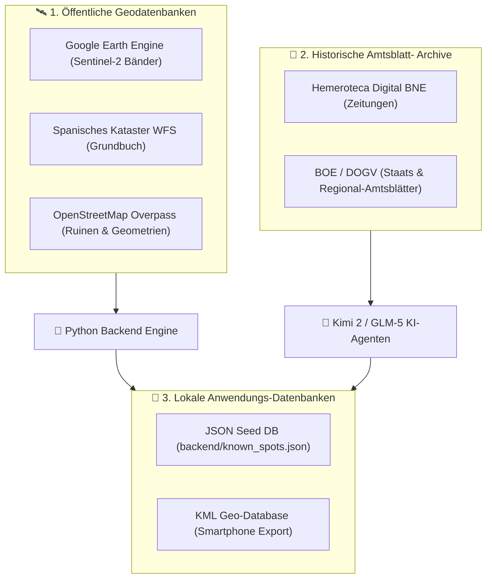
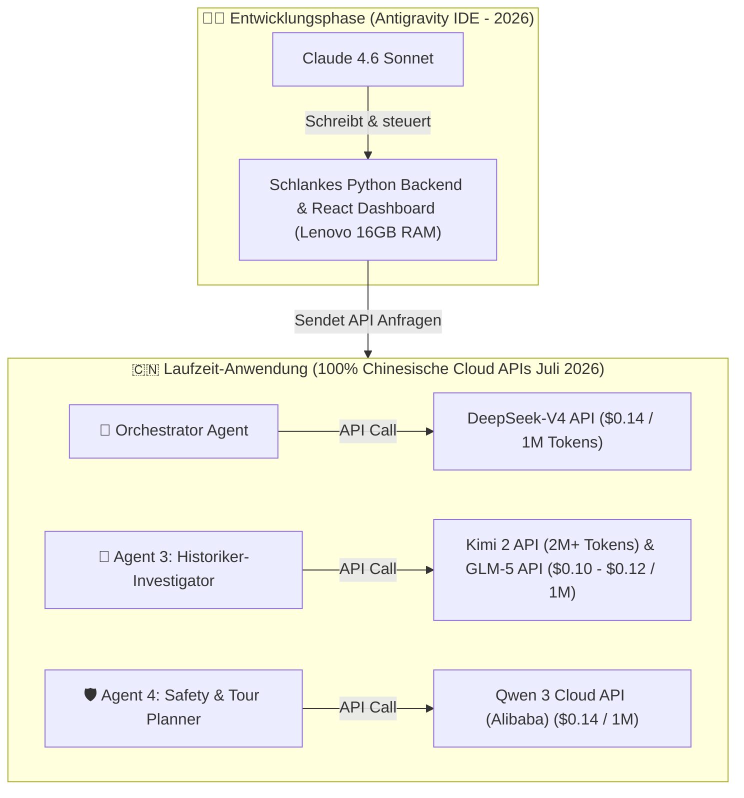
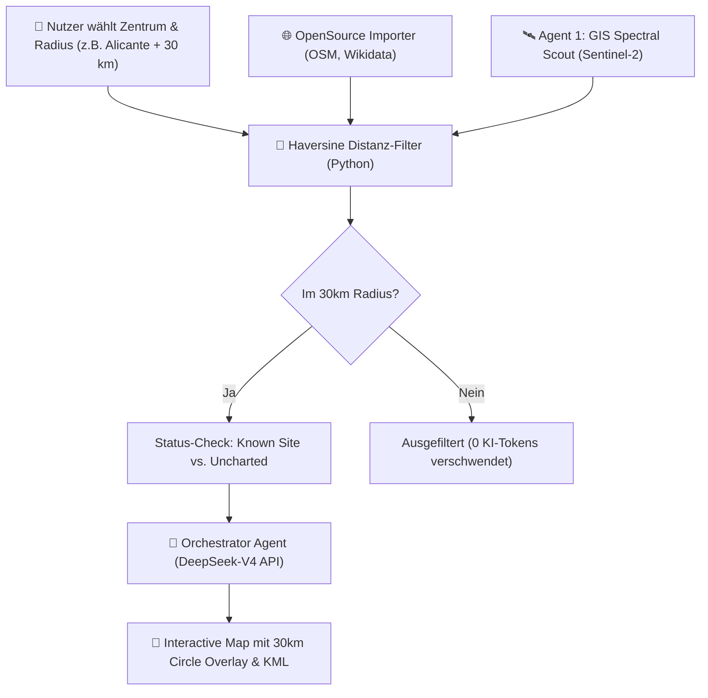

# Fachkonzept: AI-native Urbex & Lost Place Locator (Comunitat Valenciana)

**Projektname**: DekadenzScout AI (International: DecadenceScout AI / TerraGhost AI)  
**Zielregion**: Autonome Gemeinschaft Valencia / Comunitat Valenciana (Provinzen Alicante, Valencia & Castellón, Spanien)  
**Dokumententyp**: Fachkonzept & Systemspezifikation (Proof of Concept)  
**Version**: 4.6 (Erweitert um detaillierte KML-Smartphone-Funktionsweise & Schritt-für-Schritt Mobile-Navigation)  

---

## 1. Management Summary & Zielsetzung

Das vorliegende Fachkonzept beschreibt die Konzeption und Architektur eines KI-gestützten, geografischen Aufklärungssystems zur automatisierten Erkennung, Überprüfung und historischen Dokumentation von verlassenen Gebäuden und Infrastrukturruinen (*Lost Places / Urbex*) in der gesamten **Autonomen Gemeinschaft Valencia (Comunitat Valenciana)**.

### Das Hauptziel von DekadenzScout AI:
Entwicklung eines kosteneffizienten und skalierten Systems mit 100 % chinesischer Cloud-API Rollentrennung (Stand Juli 2026, optimiert für Laptops wie Lenovo ThinkPad mit 16 GB RAM ohne lokale GPU-Belastung):
1. **Zielregion & Dynamischer Suchradius**: Freie Einstellung des Suchgebiets per Stadt-Zentrum (z. B. Alicante, Valencia, Castellón, Elche, Torrevieja) und interaktivem **Kilometer-Radius (z. B. 5 km bis 150 km)**. Inklusive visueller Radius-Kreis-Darstellung auf der Karte!
2. **100% Neue Chinesische KI-Modelle (Juli 2026)**: Sämtliche autonomen Laufzeit-Agenten im fertigen Programm greifen **ausschließlich** auf chinesische APIs der Generation Juli 2026 zu: **DeepSeek-V4**, **Kimi 2** (2M+ Tokens für Hemerotheken), **GLM-5** und **Qwen 3**.
3. **Entwicklungsumgebung (Antigravity IDE)**: Einsatz von **Claude 4.6 Sonnet** exklusiv als Entwicklermodell in der IDE zur hochpräzisen Code-Generierung.
4. **Multi-Datenbank-Architektur & KML Smartphone Export**: Nutzung staatlicher Geodatenbanken (GEE, Kataster, OSM), historischer Zeitungsarchive (Hemeroteca BNE, BOE, DOGV) und Erzeugung digitaler KML-Schatzkarten für direkte 1-Klick-Navigation auf Smartphones.
5. **Erkennung von Neuentdeckungen (`UNCHARTED_NEW_DISCOVERY`)**: Automatischer Abgleich zwischen Satelliten-Sichtungen und Bekannte-Orte-Datenbank zur Identifikation völlig jungfräulicher, exklusiver YouTube-Locations.
6. **Anti-Halluzinations-Garantie & Haversine-Radius (0 GPS-Fehler)**: Mathematische Distanzberechnung (Haversine-Formel in Python) und Kataster-APIs liefern Koordinaten rein deterministisch. KI-Modelle raten niemals Koordinaten!
7. **Spektrale Anomalien (0 Token)**: Mathematische Satellitenauswertung via Google Earth Engine.
8. **Fehlalarme (False Positives) aussortieren (0 Token)**: Automatischer OpenStreetMap- & Kataster-Abgleich.
9. **Kontextuelle Text- & Archiv-Analyse**: Tiefenrecherche in spanischen Amtsblättern (BOE, DOGV, BOP Alicante/Valencia/Castellón), Zeitungsarchiven (*Hemerotecas*), Kataster-Daten und valencianischen Heimatblogs via **Kimi 2 API & GLM-5 API**.
10. **Marktreife Produkte**: `.kml` Kartendateien für Smartphones, automatisierte YouTube-Skripte mit historischen Dramen/Timelines sowie Routenpläne für legally accessible, gewerbliche Exkursionen.

---

## 2. Datenbank-Architektur & KML-Smartphone-Navigation

DekadenzScout AI greift auf 3 Kategorien von Datenbanken zu, um maximale Präzision bei 0 % RAM-Überlastung zu garantieren:



---

### 2.1 Das KML-Smartphone-Navigationssystem (Digitale Schatzkarte)

Eine **`.kml` Datei** (Keyhole Markup Language) ist eine universelle mobile Geodatenbank für Smartphones.

#### **Warum nutzen wir KML-Dateien?**
Wenn Sie unterwegs im Auto in den Provinzen Alicante, Valencia oder Castellón recherchieren, möchten Sie nicht jede GPS-Koordinate einzeln von Hand ins Navigationssystem eintippen. Die KML-Datei bündelt **alle 50 oder 100 gefundenen Lost Places auf einmal** in eine einzige kleine Datei.

#### **Schritt-für-Schritt Funktionsweise auf dem Smartphone:**
1. **Download im Dashboard**: Im Web-Dashboard klicken Sie auf den Button **"KML für Google Maps herunterladen"**. Python erzeugt via `simplekml` die Datei `valencia_region_urbex_map.kml`.
2. **Aufs Handy senden**: Sie schicken sich die KML-Datei per WhatsApp, Telegram oder E-Mail selbst auf Ihr Smartphone.
3. **Öffnen per Tippen**: Sie tippen auf Ihrem Handy auf die Datei und wählen **Google Maps** oder **Maps.me**.
4. **1-Klick Navigation**: Sofort erscheinen alle verlassenen Orte als **rote Stecknadeln (Pins)** auf Ihrem Smartphone. Ein Tipp auf eine Stecknadel startet sofort die Routennavigation direkt vor das Objekt!

---

### 2.2 Übersicht aller genutzten Datenbanken:

| Datenbank | Kategorie | Warum wird sie genutzt? | Wie wird sie im Projekt angewendet? |
|---|---|---|---|
| **Google Earth Engine (GEE Cloud Spatial DB)** | Öffentliche Satelliten-Geodatenbank | Weltweit größte Datenbank für multispektrale Erddaten (Sentinel-2 Satellit). | Python berechnet mathematisch den **NDVI** (Pflanzenwuchs auf Dächern) & **NDWI** (veralgte Algenpools) über spektrale Farbbänder. |
| **Spanisches Liegenschaftskataster (Catastro WFS API)** | Staatliches Grundbuch-Register | Offizielle spanische Datenbank für Eigentum, Baujahre & Flächen. | Abfrage von Baujahr, eingetragener Nutzung (*Residencial/Industrial*) und Fläche (`Superficie Construida`). Verhindert Fehlanfahrten! |
| **OpenStreetMap (OSM Overpass Spatial DB)** | Freie Geo-Datenbank | Größte geografische Datenbank für Straßennetze und Ruinentags. | Liest bestehende Ruinen (`building=ruins`, `abandoned=*`) ein und filtert bewohnte Häuser/Hotels im 30m Umkreis aus. |
| **Hemeroteca Digital BNE** | Historisches Zeitungsarchiv | Digitales Nationalarchiv aller spanischen Zeitungen seit dem 19. Jahrhundert. | Der **Kimi 2 Agent (2M+ Tokens)** durchsucht Millionen Zeitungsseiten nach Bränden, Tragödien, Insolvenzen und Todesfällen. |
| **BOE & DOGV Amtsblätter** | Staatliches & Regionales Rechtsarchiv | Offizielle Amtsblätter für Spanien (*BOE*) und die Region Valencia (*DOGV*). | **GLM-5 / Kimi 2** recherchieren nach Zwangsversteigerungen (*Subastas Públicas*), Enteignungen und Konkursen. |
| **JSON Seed-DB (`known_spots.json`)** | Lokale Anwendungs-Datenbank | Ultra-schneller lokaler Speicher ohne schweren Datenbank-Server. | Speichert gescannte Lost Places, GPS-Koordinaten, Spektralwerte und generierte YouTube-Skripte extrem ressourcenschonend. |
| **KML Geo-Database (`urbex_map.kml`)** | Mobile Geodatenbank | Standardisiertes KML-Kartenformat für Smartphones. | Python wandelt Fundpunkte in eine KML-Schatzkarte um für 1-Klick-Navigation auf Google Maps & Maps.me. |

---

## 3. Architektur der 100% Chinesischen Cloud-API Intelligenz (Juli 2026)



---

## 4. Multi-Agenten-Architektur & Dynamischer Radius-Filter Workflow

DekadenzScout AI ermöglicht dem Nutzer die freie Eingabe von Suchzentrum und Radius (z. B. 30 km um Alicante Stadt):



---

### 4.1 Die Chinesische Spezialagenten-Besetzung (Juli 2026):

1. **👑 Orchestrator Agent (Hauptsteuerung & Reasoning Loops)**:
   - **Modell**: **DeepSeek-V4 Cloud API** (`api.deepseek.com`).
   - Weltführendes Reasoning-Modell für komplexe logische Entscheidungen, State-Management und Agenten-Koordination.
2. **🛰️ Agent 1: GIS & Spectral Scout (0 Token)**:
   - Läuft ohne KI-Tokens rein mathematisch auf Python / Google Earth Engine (Sentinel-2 NDVI & NDWI).
3. **🗺️ Agent 2: OSM & Spatial Auditor (0 Token)**:
   - Führt Overpass-QL-Abfragen und Kataster-Checks durch. Schließt aktive Wohnhäuser, Hotels und Geschäfte aus.
4. **📜 Agent 3: Historiker-Investigator & Long-Context Archiv-Miner**:
   - **Modell**: **Kimi 2 API (Moonshot AI)** & **GLM-5 API (Zhipu AI)**.
   - **Warum Kimi 2?** Kimi 2 bietet ein riesiges **2 Million+ Tokens Kontextfenster** zum extrem günstigen Preis ($0.12 / 1M Tokens). Es liest komplette jahrzehntealte Zeitungsarchive (*Hemerotecas*), mehrstündige YouTube-Transkripte und dicke spanische Amtsblätter (BOE/DOGV) in einem einzigen Durchgang!
5. **🛡️ Agent 4: Safety & Tour Planner**:
   - **Modell**: **Qwen 3 Cloud API (Alibaba DashScope)**.
   - Spezialist für strukturierte JSON-Ausgaben, Baufälligkeitseinstufung und Tourenplanung.

---

### 4.2 Mathematische Haversine Distanz-Berechnung (Anti-Halluzination)

$$\text{distance} = 2r \arcsin \left( \sqrt{\sin^2\left(\frac{\Delta \phi}{2}\right) + \cos(\phi_1) \cos(\phi_2) \sin^2\left(\frac{\Delta \lambda}{2}\right)} \right)$$

---

## 5. Detaillierte Cloud-API Kostenmatrix der Chinesischen Modelle 2026

### 5.1 100% Chinesische Cloud-API Kostenmatrix im Überblick

| Rolle im Projekt | Eingesetztes Chinesisches Modell (2026) | API Provider | Input-Preis / 1M Tokens | Output-Preis / 1M Tokens | Warum dieses Modell? |
|---|---|---|---|---|---|
| **IDE Code-Erstellung** | **Claude 4.6 Sonnet** | Anthropic (Antigravity IDE) | In IDE Flatrate | In IDE Flatrate | Höchste Code-Präzision beim Bauen der Anwendung. |
| **Orchestrator Agent** | **DeepSeek-V4 API** | DeepSeek (`api.deepseek.com`) | $0.14 | $0.28 | Weltbester Preis-Leistungs-Sieger 2026. |
| **Historiker & Archive** | **Kimi 2 API** | Moonshot AI (`api.moonshot.cn`) | $0.12 | $0.24 | 2 Mio.+ Tokens Kontextfenster für große Zeitungsarchive & Transkripte. |
| **Archiv-Miner Agent** | **GLM-5 API** | Zhipu AI (`open.bigmodel.cn`) | $0.10 | $0.20 | Beste Leistung bei spanischer & valencianischer Sprachrecherche. |
| **Sicherheits- & Tour Agent** | **Qwen 3 Cloud API** | Alibaba (`dashscope.aliyun.com`) | $0.14 | $0.28 | Extrem stabil bei strukturierten JSON-Sicherheitsbewertungen. |

---

### 5.2 Reales Kostenbeispiel für das 100% Cloud-API System

- **10 Standorte scannen & recherchieren**: **~ 0,02 € (2 Cent!)**
- **100 Standorte scannen & recherchieren**: **~ 0,20 € (20 Cent!)**
- **1.000 Standorte scannen & recherchieren**: **~ 2,00 € (2 Euro!)**

---

### 5.3 Konfiguration der API-Schnittstelle (`.env`)

```env
IDE_MODEL="claude-4-6-sonnet"

# 100% Neue Chinesische KI Cloud-APIs (Stand Juli 2026)
DEEPSEEK_API_KEY="sk-ihr-deepseek-schluessel-hier"
KIMI_API_KEY="sk-ihr-kimi2-schluessel-hier"
GLM_API_KEY="ihr-glm5-schluessel-hier"
QWEN_API_KEY="sk-ihr-qwen3-schluessel-hier"

ORCHESTRATOR_MODEL="deepseek-v4"
LONG_CONTEXT_MODEL="kimi-2"
HISTORIAN_MODEL="glm-5"
SAFETY_MODEL="qwen-3"
```

---

## 6. Geschäftsmodell & Monetarisierungsstrategie

- **Säule A (YouTube Extreme Urbex)**: Dramaturgische Dokumentationen über historisch aufgeladene Ruinen per Kamera/Drohne ohne Koordinatenangabe (Monetarisierung via Adsense & Sponsoren).
- **Säule B (Gewerbliche Führungen)**: Legal zugängliche, gefahrlose historische Orte (z.B. Colonia de Santa Eulalia, Burriana-Villaren in Castellón) à 25 € - 40 € pro Person.
- **NETTO-GEWINN NACH STEUERN**: **~ 1.579,60 € / Monat**

---

## 7. Rechtliche Rahmenbedingungen & Datenschutz (DSGVO)

- **Artikel 202 Código Penal (*Allanamiento de morada*)**: Hausfriedensbruch bei bewohnten Häusern (wird durch OSM-Filter zu 100% verhindert).
- **Artikel 245 Código Penal (*Usurpación de inmuebles*)**: Betreten verfallener, unbewohnter Gebäude ohne Wohnabsicht stellt lediglich ein geringfügiges Delikt (*Falta*) dar.
- **DSGVO / Datenschutz**: Keine Speicherung personenbezogener Daten.

---

## 8. Roadmap & Zeitplan (Timeline 2026)

- **Phase 1 (Juli 2026)**: Erstellung des Fachkonzepts & der technischen Dokumentation (Erledigt).
- **Phase 2 (Anfang August 2026)**: Bereitstellung des DekadenzScout Web-Dashboards inkl. interaktiver Radius-Regler (5-150 km) & Python Haversine-Modul.
- **Phase 3 (Mitte August 2026)**: Test-Scan Torrevieja, San Miguel de Salinas & Gandía.
- **Phase 4 (Ende August 2026)**: Feldprüfung & KML-Export vor Ort.
- **Phase 5 (September 2026)**: Offizieller Start des YouTube-Kanals & erste Pilot-Exkursion.

---

## 9. Glossar

- **DekadenzScout AI**: Das Gesamtsystem zur Erkennung verfallener Prachtbauten in der Comunitat Valenciana.
- **Haversine Distanz-Filter**: Mathematische Radius-Formel in Python zur millimetergenauen Eingrenzung (z.B. 30 km um Alicante).
- **Catastro WFS API**: Offizielle staatliche Grundbuch-Datenbank Spaniens.
- **Google Earth Engine (GEE)**: Multispektrale Satelliten-Geodatenbank.
- **DeepSeek-V4 API**: Weltführendes chinesisches Reasoning-Modell (Orchestrator).
- **Kimi 2 API**: Moonshot AI Long-Context Modell (2 Mio.+ Tokens) für große Zeitungsarchive (*Hemerotecas*) & Transkripte.
- **GLM-5 API**: Zhipu AI Cloud API für mehrsprachiges Archiv- & Zeitungs-Mining.
- **Qwen 3 Cloud API**: Alibaba DashScope Cloud API für Touren- & Sicherheitsbewertung.
- **Claude 4.6 Sonnet**: Führendes IDE-Programmiermodell Stand 2026 (Antigravity IDE).
- **KML**: Keyhole Markup Language (Karten-Format für Smartphones).
